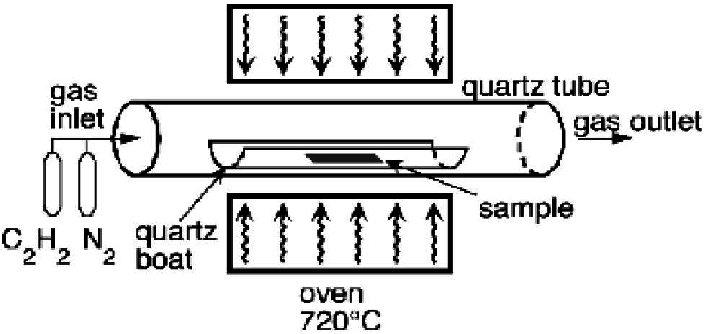
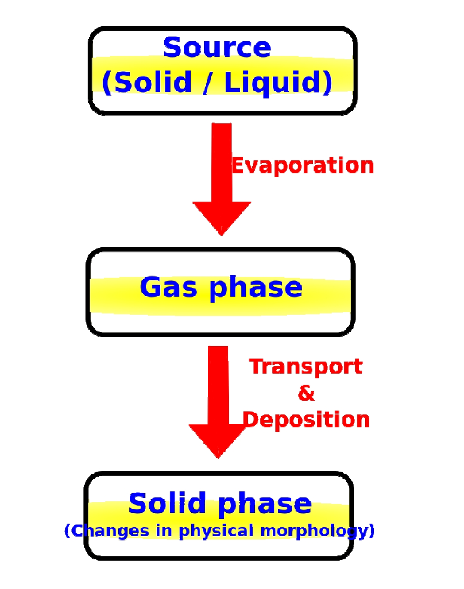

# Assignment 1

## Table of Content

- [HOME](../README.md)
- [Assignment 2](../assignment2/README.md)

---

### Describe the applications of Nanotechnology in Medicine

>Nanotechnology, the manipulation of matter on an atomic and molecular scale, has emerged as a groundbreaking field with a myriad of applications in medicine. Its transformative potential is evident in various aspects of diagnostics, treatment, and drug delivery.

>**1. Drug Delivery Systems:**
   Nanoparticles, manipulated at the molecular level, offer a sophisticated means of drug delivery. Engineered to carry therapeutic agents, they can precisely target diseased cells, reducing side effects and enhancing treatment effectiveness. For instance, loading nanoparticles with cancer drugs allows for direct delivery to tumors, sparing healthy cells from harm.

>**2. Diagnostic Imaging:**
   Nanoparticles, particularly quantum dots, serve as contrast agents in diagnostic imaging techniques like MRI and CT scans. By enhancing visibility, nanoparticles enable more accurate and early disease diagnosis. Coating nanoparticles with specific antibodies can make cancer cells appear more prominently in imaging, aiding in detection.

>**3. Cancer Treatment:**
   Nanoparticles play a crucial role in revolutionizing cancer treatment. Their ability to selectively target cancer cells ensures the delivery of therapeutic agents with precision, minimizing collateral damage to surrounding healthy tissues and improving overall treatment efficacy.

>**4. Theranostics:**
   Nanotechnology enables the integration of therapy and diagnostics, allowing for real-time monitoring of treatment effectiveness. This theranostic approach ensures timely adjustments to treatment plans based on evolving conditions.

>**5. Regenerative Medicine:**
   Nanoparticles contribute to tissue engineering by creating robust and biocompatible scaffolds. In applications like bone grafts, nanoparticles provide structural support for cell growth while releasing drugs that promote tissue regeneration.

>**6. Biosensors:**
   The creation of nanoscale biosensors facilitates real-time disease detection. Coating nanoparticles with specific biological molecules allows for the detection of target substances, offering potential breakthroughs in early diagnosis and monitoring.

>**7. Antimicrobial Nanoparticles:**
   Nanoparticles with antimicrobial properties present an innovative approach to combating infections, providing an alternative to traditional antibiotics. This application holds promise in addressing the growing challenge of antibiotic resistance.

>**8. Smart Implants:**
   Nanotechnology enables the development of smart implants that respond to physiological changes. These implants can release drugs or adjust their properties in response to specific signals, enhancing their adaptability and efficacy.

>**9. Targeted Therapies:**
   Functionalizing nanoparticles for specific targeting enhances the precision of therapeutic interventions. This targeted approach ensures that treatments act directly on intended cells or tissues, optimizing their impact.

>**10. Wound Healing:**
    Incorporating nanomaterials into wound dressings improves healing processes and reduces infection risks. Nanoparticles contribute to the development of advanced wound care solutions that promote efficient and effective tissue repair.

>As nanotechnology research progresses, the integration of these applications in medicine holds the promise of revolutionizing healthcare practices in the years to come. The potential for personalized and highly effective treatments underscores the importance of continued exploration and innovation in this dynamic field.

---

### Describe the working-principles of Chemical Vapor Deposition (CVD) and Physical Vapor Deposition (PVD) by suitable diagrams

>**Chemical Vapor Deposition (CVD):** CVD is a technique for depositing thin films on a substrate through a chemical reaction of gaseous precursors. For example, silicon tetrachloride (Al(CH3)3) is used to deposit silicon dioxide (SiO2), and trimethylaluminum (Al(CH3)3) is used to deposit aluminum (Al). The process involves several steps:

>1. **Precursor Delivery:**
   Gaseous precursors containing the desired materials, such as silicon tetrachloride (SiCl4) or trimethylaluminum (Al(CH3)3), are introduced into a reaction chamber.

>2. **Chemical Reaction:**
   Within the reaction chamber, the precursors undergo a chemical reaction, often at elevated temperatures, resulting in the formation of a solid material or thin film.

>3. **Film Deposition:**
   The reaction by-products are removed, and the desired material is deposited onto the substrate, forming a thin film. The entire process includes source gas preparation, transport to the substrate, reaction with the substrate, and removal of reaction byproducts.

>**Physical Vapor Deposition (PVD):** PVD is a method for depositing thin films through the physical transport of material from a solid source to a substrate. For example, silicon is used to deposit silicon dioxide (SiO2), and aluminum is used to deposit aluminum (Al). The process can be broken down into three main steps:

>1. **Source Material Evaporation:**
   The source material, typically a solid, undergoes evaporation or sputtering into a vapor phase. This can be achieved through methods such as thermal evaporation or sputtering.

>2. **Vapor Transport:**
   The vaporized material is transported through a vacuum to the substrate. The substrate is usually at a lower pressure compared to the source material.

>3. **Film Formation:**
   The vapor condenses on the substrate surface, forming a thin film as the material loses energy and returns to a solid state.

>**Differences between CVD and PVD:**
>| Feature | CVD | PVD |
>|---|---|---|
>| Source Material | Gas or vapor | Solid |
>| Deposition Process | Chemical reaction | Physical vaporization |
>| Film Thickness | Can be very thick | Typically thin |
>| Film Uniformity | Can be very uniform | Can be less uniform |
>| Applications | Wide variety of materials | Semiconductors, insulators, conductors, dielectrics |

>In summary, CVD and PVD are versatile and powerful techniques used to deposit thin films with a wide range of properties. While CVD relies on chemical reactions in the gaseous phase, PVD involves the physical transport of material in a vapor phase from a solid source to the substrate. Understanding these processes is crucial in various applications, including the fabrication of semiconductors, insulators, conductors, and dielectrics.

---

### Describe the working principles of Spin Coating and Lithography

>**Spin Coating:** Spin coating is a thin-film deposition technique that uses centrifugal force to spread a liquid film uniformly over a substrate. It is a versatile and widely used technique for depositing thin films of a variety of materials, including polymers, metals, and ceramics.

>**Working Principle:**

>1. **Substrate Preparation:**
   The substrate, typically a silicon wafer or glass, undergoes thorough cleaning and preparation for the thin film deposition.

>2. **Coating Solution Application:**
   A liquid coating solution, often a polymer or photoresist, is dispensed onto the center of a spinning substrate.

>3. **Rotation:**
   The substrate is set into rapid rotation, generating centrifugal force that spreads the liquid uniformly across the substrate surface, forming a thin, even film.

>4. **Evaporation:**
   As the substrate continues to spin, excess solvent from the coating solution evaporates, leaving behind a precisely coated layer.

>5. **Film Thickness Control:**
   Factors such as the viscosity of the coating solution, spin speed, and spin time are controlled to achieve the desired thickness of the deposited film.

>Spin coating is a widely used technique for depositing thin films in a variety of applications, including:
>
>- Semiconductor fabrication
>- Microelectronics
>- Photonics
>- Biomedical applications
>- Energy applications

>**Lithography:** Lithography is a technique used to transfer a pattern from a mask onto a substrate. It is a critical step in the fabrication of integrated circuits, microelectromechanical systems (MEMS), and other nanodevices.

>**Working Principle:**

>1. **Substrate Coating:**
   A thin film, often a photoresist, is applied to the substrate using techniques like spin coating.

>2. **Exposure to Light:**
   The coated substrate is exposed to light through a photomask. The photomask contains a pattern that is transferred to the photoresist.

>3. **Photochemical Reaction:**
   The exposed photoresist undergoes a photochemical reaction, leading to a change in solubility. This change makes certain areas of the photoresist more susceptible to development.

>4. **Development:**
   The substrate is developed using a chemical solution. The developer removes either the exposed or unexposed areas of the photoresist, depending on the type of photoresist used.

>5. **Pattern Transfer:**
   The developed pattern in the photoresist serves as a mask for further processes like etching or deposition, transferring the pattern to the underlying material.

>Lithography is a critical technique in the fabrication of a wide variety of devices, including:
>
>- Integrated circuits
>- Microelectromechanical systems (MEMS)
>- Nanodevices
>- Printed circuit boards (PCBs)
>- Flat panel displays

---

### Describe the working principles of Wet Etching and Plasma Etching

>Etching is a process that is used to remove material from a substrate to create patterns or structures at the nanoscale level. It can create structures and patterns with nanometer precision and accuracy. Etching can also modify the physical, chemical, and electrical properties of the material, which can affect the performance and functionality of the nanodevices.

>**Wet (liquid-phase) Etching:** Wet etching is a subtractive process that uses a liquid chemical solution to remove material from a substrate. The type of chemical solution used depends on the type of material being etched. For example, hydrofluoric acid (HF) is used to etch silicon dioxide (SiO2), and sulfuric acid (H2SO4) is used to etch aluminum (Al).

>**Working Principle:**

>1. **Substrate Preparation:**
   The substrate, often a silicon wafer, undergoes cleaning and is coated with a material like a thin film of photoresist or masking material.

>2. **Masking:**
   A mask is applied to protect specific areas of the substrate from the etching solution. This mask can be a patterned photoresist or another material resistant to the etchant.

>3. **Etchant Application:**
   The substrate is immersed in a liquid etchant solution, which selectively reacts with and removes the exposed areas of the substrate material.

>4. **Etching Reaction:**
   The etchant chemically reacts with the unprotected parts of the substrate, leading to the dissolution or removal of material.

>5. **Rinse and Cleaning:**
   After achieving the desired etching, the substrate is thoroughly rinsed and cleaned to stop the etching process and remove any residual etchant.

>**Plasma (dry) Etching:** Plasma etching is a subtractive process that uses a plasma, or ionized gas, to remove material from a substrate. The plasma is created by applying an electric field to a gas. The ions in the plasma bombard the substrate, removing material through a sputtering process.

>**Working Principle:**

>1. **Vacuum Chamber:**
   The substrate is placed in a vacuum chamber, and the chamber is evacuated to create a low-pressure environment.

>2. **Gas Introduction:**
   Reactive gases, often containing fluorine or chlorine, are introduced into the chamber. These gases form a plasma when subjected to radiofrequency (RF) energy.

>3. **Plasma Formation:**
   RF energy ionizes the gas, creating a plasma—a state where ions and electrons coexist. High-energy ions in the plasma are directed toward the substrate.

>4. **Chemical Reaction:**
   Reactive ions in the plasma chemically react with the substrate material, causing etching. Selectivity is achieved through the choice of gases and process conditions.

>5. **Etch Mask:**
   A mask, usually a patterned material on the substrate, protects specific areas from the plasma, defining the pattern to be etched.

>6. **Evacuation and Cleaning:**
   Once desired etching is achieved, the chamber is evacuated, and the substrate is cleaned to remove any remaining by-products.

>**Differences between Wet Etching and Plasma Etching:**
>| Feature | Wet Etching | Plasma Etching |
>|---|---|---|
>| Etching medium | Liquid chemical solution | Plasma, or ionized gas |
>| Material removal mechanism | Chemical dissolution | Physical sputtering |
>| Selectivity | Can be less selective | Can be highly selective |
>| Anisotropy | Can be isotropic or anisotropic | Can be highly anisotropic |
>| Applications | Widely used in the fabrication of integrated circuits, microelectromechanical systems (MEMS), and other nanodevices | Widely used in the fabrication of integrated circuits, microelectromechanical systems (MEMS), and other nanodevices |

---

### Describe the working-principles of Vapour Phase Epitaxy, Liquid Phase Epitaxy, Solid Phase Epitaxy, and Molecular Beam Epitaxy

>**Vapour Phase Epitaxy (VPE):** A process for growing thin films of crystalline materials by depositing gaseous precursors onto a heated substrate. The precursors are transported to the substrate by a gas flow, and they react on the surface to form the desired film.

>**Working Principle:**

>1. **Vapor Precursors:**
   In VPE, gaseous precursors containing the desired elements are introduced into a reaction chamber.
>2. **Substrate Preparation:**
   A substrate, typically a crystalline wafer, is carefully prepared and placed in the reaction chamber.
>3. **Chemical Reaction:**
   The precursor gases undergo chemical reactions on the substrate surface, leading to the deposition of a crystalline layer with controlled thickness and composition.
>4. **Growth Process:**
   The crystal layer grows atom by atom, following the crystal structure of the substrate, resulting in a high-quality epitaxial layer.

>**Liquid Phase Epitaxy (LPE):** A process for growing thin films of crystalline materials by dipping a substrate into a molten solution of the desired material. The material dissolves in the solution, and then it deposits onto the substrate as the solution cools.

>>**Working Principle:**

>1. **Molten Solution:**
   A substrate is dipped into a molten solution containing the elements needed for the epitaxial growth.

>2. **Temperature Control:**
   The temperature is carefully controlled to allow controlled crystallization of the material onto the substrate.

>3. **Growth on Substrate:**
   The crystalline material from the solution adheres to the substrate and grows in an ordered manner, following the crystal structure of the substrate.

>4. **Layer Formation:**
   As the substrate is slowly withdrawn from the solution, a single crystal layer is formed on its surface.

>**Solid Phase Epitaxy (SPE):** A process for growing thin films of crystalline materials by heating a substrate in the presence of a gas that contains the desired material. The gas molecules adsorb onto the substrate, and then they diffuse to the surface and react to form the desired film.

>**Working Principle:**

>1. **Amorphous Layer Formation:**
   An amorphous (non-crystalline) layer is initially deposited on the substrate using techniques like sputtering or deposition.

>2. **Annealing:**
   The substrate is then subjected to high-temperature annealing, causing the amorphous layer to undergo a transformation into a crystalline structure.

>3. **Crystalline Growth:**
   The crystalline structure grows epitaxially from the substrate, resulting in a well-ordered crystal layer.

>**Molecular Beam Epitaxy (MBE):** A process for growing thin films of crystalline materials by depositing atomic or molecular beams onto a heated substrate. The beams are created by evaporating or sputtering the desired material, and they are directed onto the substrate in a vacuum chamber.

>**Working Principle:**

>1. **Ultra-High Vacuum (UHV) Environment:**
   MBE takes place in an ultra-high vacuum chamber to minimize impurities and enable precise control.

>2. **Elemental Sources:**
   High-purity elemental sources, typically in the form of solid cells, are used to provide the materials for epitaxial growth.

>3. **Layer-by-Layer Growth:**
   The elemental beams are precisely directed onto the substrate, allowing for layer-by-layer growth with atomic precision.

>4. **Crystal Control:**
   The growth is controlled by adjusting the flux of elemental beams, enabling the creation of complex structures with well-defined interfaces.

---

### Describe the working-principle of Atomic Layer Deposition

>**Atomic Layer Deposition (ALD):** Atomic Layer Deposition (ALD) is a thin film deposition technique that uses alternating cycles of precursor gases to deposit thin films of materials onto a substrate. The precursor gases are introduced into the reaction chamber one at a time, and they react with the surface of the substrate to form a single layer of the desired material. This process is repeated until the desired film thickness is achieved.

>**Working Principle:**

>1. **Surface Preparation:**
   The substrate is prepared and placed in a reaction chamber. The surface may undergo pre-treatment to ensure uniform deposition.

>2. **Sequential Precursor Exposure:**
   The substrate is exposed sequentially to two or more gaseous precursors. Each precursor reacts with the substrate surface in a self-limiting manner.

>3. **Purge Steps:**
   After each precursor exposure, the chamber is purged to remove any unreacted precursors and by-products. This step ensures that only a monolayer of material is deposited during each cycle.

>4. **Repeat Cycles:**
   The exposure and purge steps are repeated in cycles until the desired film thickness is achieved. ALD allows precise control over thickness at the atomic level.

>5. **Film Growth:**
   The repeated cycles result in the layer-by-layer growth of a thin film with excellent conformality and uniformity, even on complex three-dimensional structures.

---

### Describe the features of Quantum Dots

>**Quantum Dots:** Quantum dots (QDs) are semiconductor nanoparticles that are typically a few nanometers in size. They have unique properties that make them useful in a variety of applications, including solar cells, light-emitting diodes (LEDs), biological imaging, and quantum computing.

>**Features of Quantum Dots:**

>1. **Size-dependent Properties:**
   Quantum dots are semiconductor nanocrystals with size-dependent electronic and optical properties. Their properties, such as bandgap and emission wavelength, vary with size.

>2. **Quantum Confinement:**
   Quantum dots exhibit quantum confinement effects due to their small size. Electrons and holes are confined in three dimensions, leading to discrete energy levels.

>3. **Tunable Emission:**
   The emission wavelength of quantum dots can be tuned by controlling their size. This tunability is valuable in applications like displays, imaging, and lighting.

>4. **High Brightness:**
   Quantum dots can emit light with high brightness and have broad absorption spectra, making them suitable for vibrant and efficient displays.

>5. **Applications in Biomedicine:**
   Quantum dots are used in biological imaging due to their bright and stable fluorescence. They can be functionalized for targeted imaging and drug delivery.

>6. **Photovoltaics:**
   Quantum dots are explored in solar cell technologies. Their size-dependent electronic properties can be tailored for efficient light absorption and charge transport.

>7. **Single Electron Transistors:**
   In nanoelectronics, quantum dots can be used as single electron transistors, allowing precise control over individual electrons.

>8. **Colloidal Stability:**
   Quantum dots can be synthesized as colloidal nanoparticles, providing stability in various solvents and enabling their incorporation into diverse applications.

---
